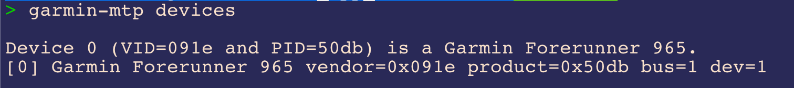
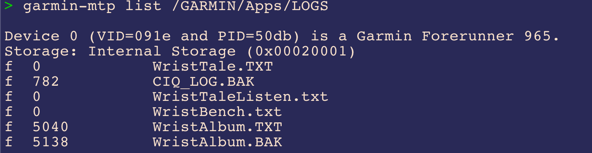
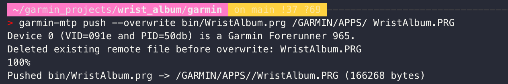

# Garmin MTP CLI

No more dragging Garmin files: import and export from your watch with one command.

Garmin MTP CLI is a command line tool for reading and writing files exposed by a Garmin watch over MTP.

Full MTP builds use `libmtp` directly. The tool does not mount the watch as a normal filesystem and does not bypass Garmin's secure storage rules. If a path is not visible through the MTP object tree, this tool cannot read or write it.

The primary command is `garmin-mtp`. Installs also provide `garminmtp` as a compatibility alias.

## Command output

Detect connected Garmin MTP devices:



List files in a watch directory:



Push and explicitly overwrite an existing remote file:



## Examples

- [Natural language examples for Codex or Claude Code](examples/natural-language.md)
- [CLI example: pull CIQ logs from a Garmin watch](examples/cli-ciq-log.md)

## Codex and Claude Code skill

This repository includes a `garmin-mtp` skill at `skills/garmin-mtp` for agents that work with Codex-style `SKILL.md` folders.

Install directly from GitHub with `npx`:

```sh
npx github:Likenttt/garmin-mtp-cli install --target codex
npx github:Likenttt/garmin-mtp-cli install --target claude
npx github:Likenttt/garmin-mtp-cli install --target both
```

After publishing the npm package, the same installer can be run as:

```sh
npx garmin-mtp-skill install --target both
```

For installers that accept a GitHub skill path directly, use:

```text
Likenttt/garmin-mtp-cli/skills/garmin-mtp
```

Restart Codex or Claude Code after installing the skill.

## Build

Install dependencies:

```sh
brew install libmtp pkgconf
```

Build:

```sh
make
```

Or with CMake:

```sh
cmake -S . -B build/cmake
cmake --build build/cmake
ctest --test-dir build/cmake --output-on-failure
```

On Windows, the default CMake build compiles the CLI and tests without the libmtp backend because libmtp is not currently reliable through vcpkg/MSYS2 on Windows:

```sh
cmake -S . -B build/cmake -DGARMIN_MTP_WITH_LIBMTP=OFF
cmake --build build/cmake
ctest --test-dir build/cmake --output-on-failure
```

Run the smoke check:

```sh
make check
```

Run unit tests only:

```sh
make test
```

## Project layout

- `src/main.c` - thin command dispatcher.
- `src/cli.*` - option parsing and help text.
- `src/manual.*` - built-in directory manual shown by `manual` and `menu`.
- `src/path.*` - MTP/local path parsing helpers.
- `src/file_type.*` - local filename to MTP file type mapping.
- `src/mtp_tree.*` - Garmin/MTP storage and folder tree matching.
- `src/mtp_device.*` - libmtp device detection, opening, and file lookup.
- `src/commands.*` - command orchestration for `devices`, `dump`, `list`, `pull`, and `push`.
- `tests/` - unit tests for pure logic and fake MTP object-tree matching.

The unit tests intentionally do not open a real watch. Use `devices`, `dump`, and a known harmless `pull` path as manual integration checks when a watch is connected.

Optional install:

```sh
make install PREFIX="$HOME/.local"
```

## Usage

List connected MTP devices:

```sh
build/garmin-mtp devices
```

Show the directory manual:

```sh
build/garmin-mtp manual
build/garmin-mtp menu
```

List storages:

```sh
build/garmin-mtp list /
```

Dump raw storage, folder, and file object ids for debugging secure MTP behavior:

```sh
build/garmin-mtp dump
```

List a directory:

```sh
build/garmin-mtp list /GARMIN
```

Pull a file from the watch:

```sh
build/garmin-mtp pull /GARMIN/APPS/EXAMPLE.PRG ./EXAMPLE.PRG
```

Push a local file into an existing directory on the watch:

```sh
build/garmin-mtp push ./EXAMPLE.FIT /GARMIN/NEWFILES
```

Overwrite an existing remote file only when explicitly requested:

```sh
build/garmin-mtp push --overwrite ./EXAMPLE.FIT /GARMIN/NEWFILES
```

`--overwrite` deletes the existing remote object first, then uploads the new file. If deletion fails, upload is not attempted.

If multiple MTP devices or storage volumes are present, use:

```sh
build/garmin-mtp --device-index 1 list /
build/garmin-mtp --storage "Primary Storage" list /GARMIN
```

## Notes

- `push` does not overwrite existing remote files unless `--overwrite` is passed.
- `push` requires the remote directory to already exist.
- The first path segment may be a storage name, volume identifier, decimal storage id, or hex storage id such as `0x00010001`.
- macOS MTP access can fail if another app has already claimed the USB device. Close Garmin Express, Android File Transfer, or any other MTP process before retrying.
- On macOS, if Android File Transfer or Garmin Express appears to be running when device detection/opening fails, the tool prints a text hint with the matching background process.

## License

MIT
